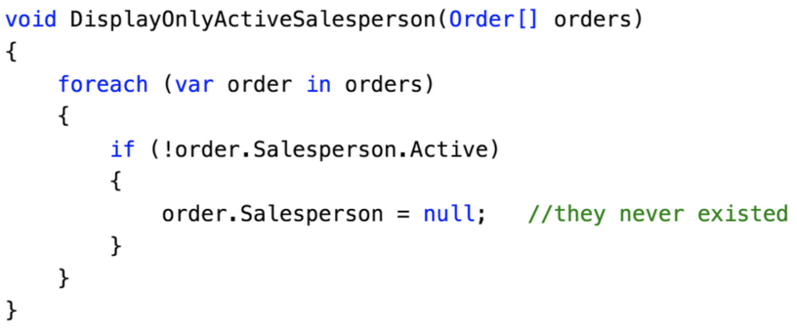

## Using <span class="orange">Immutable</span> Data Structures 
#### In C# and .NET

### @schneidenbach

---

```csharp
var person = new Person();
```

---

```csharp
var person = new Person();
person.FirstName = "Spencer";
```

---

```csharp
var person = new Person();
person.FirstName = "Spencer";
person.LastName = "Schneidenbach";
```

---


---

```csharp
var person = new Person();
//person.FirstName = "Spencer";
//person.LastName = "Schneidenbach";
```

---

# Questions?

---


---

# <span class="orange">Functional</span> programming

---

### Q. How do you know someones "does" <span class="orange">functional programming</span>?

---

# <span class="orange">Functional</span> programming

---

# immutability

---

# <span class="orange">WARNING</span>
There are a lot of bad immutability jokes in this slide deck

---

# Have you done <span class="orange">this</span>?

---


---


---


---


---



---


---


---


---


---

## `NullReferenceException`

---

## `NullReferenceException`
cause you mutated your data

---

## `NullReferenceException`
cause you mutated your data  
...among other things

---

## Mixed <span class="orange">data</span> and <span class="orange">view stuff</span>

---

# BUGS

---

Passing mutable data to methods is basically <span class="orange">giving that method permission to change the data</span> when it suits them

---

# Sacrifice
Ease of change vs safety

---


---


---


---


---

> A large fraction of the flaws in software development are due to programmers not fully understanding all the possible states their code may execute in.

John Carmack

---

### Change Tweet w/ edit button
- What if it's been retweeted?
- What if it's been liked?
- What if it's been quoted?
- Does the date/time stamp get reset?

---

### Change Tweet w/o edit button
- ...You can't

---


---

```csharp
public void DoSomething(List<string> list);
```

---

```csharp
public void DoSomething(List<string> list);
```

* Can I add to this list?
* Can I remove elements?
* Why am I getting a list vs. `IEnumerable<string>`?

---


---

## <span class="orange">Multithreaded</span> data

---


---


---


---

History of Immutability in C#

---

# `string`
# `DateTime`
# number types

---

```csharp
var str = "replaceable?";
str.Replace("?", "!");
Console.WriteLine(str);
```

---

```csharp
var str = "replaceable?";
str.Replace("?", "!");
Console.WriteLine(str);
//output: replaceable?
```

---

```csharp
var now = DateTime.Now;
now.AddHours(1);
```

---

```csharp
var now = DateTime.Now.AddHours(1);
```

---

# C# classes

---

```csharp
public class Person
{
    //readonly fields - does the job... but very ugly
    public readonly string _firstName;
    public string FirstName
    {
        get
        {
            return _firstName;
        }
    }

    public Person(string firstName)
    {
        _firstName = firstName;
    }
}
```

---

```csharp
public class Person
{
    //private setters - still mutable
    public string FirstName { get; private set; }
    public string LastName { get; private set; }

    public Person(string firstName, string lastName)
    {
        FirstName = firstName;
        LastName = lastName;
    }
}
```

---

### `private get` or `readonly` fields

---

### `private get` or `readonly` fields
Neither solve the problem perfectly

---

# C# 6

```csharp
public class Person
{
    public string FirstName { get; }
    public string LastName { get; }

    public Person(string firstName, string lastName)
    {
        FirstName = firstName;
        LastName = lastName;
    }
}
```

---

# Much better!

```csharp
public class Person
{
    public string FirstName { get; }
    public string LastName { get; }

    public Person(string firstName, string lastName)
    {
        FirstName = firstName;
        LastName = lastName;
    }
}
```

---

# Immutability today

---

# <span class="orange">LINQ</span>

---

## Anonymous types

---

```csharp
var projection = employees.Select(e => new {
    e.FirstName,
    e.LastName,
    e.Number,
    ManagerCode = e.Manager?.Number
});
```

---

## <span class="orange">Anonymous types</span>
* Immutable
* Structural equality*

*VB.NET, it's opt in

---

# YAY
```csharp
var projection = employees.Select(e => new {
    e.FirstName,
    e.LastName,
    e.Number,
    ManagerCode = e.Manager?.Number
});
```
Can't touch this!

---

## <span class="orange">LINQ</span> methods

---

## <span class="orange">LINQ</span> methods
`Where<T>`   
`Select<T>`

---

```csharp
var employees = GetEmployees();
employees
.Where(e => e.FirstName.StartsWith("S"))
.Select(e => new {
    e.FirstName,
    e.LastName,
    e.Number,
    ManagerCode = e.Manager?.Number
});
```

---

```csharp
var employees = GetEmployees();
employees
.Where(e => e.FirstName.StartsWith("S"))
.Select(e => new {
    e.FirstName,
    e.LastName,
    e.Number,
    ManagerCode = e.Manager?.Number
});
```
"Return value of pure method is not used"

---

# <span class="orange">Projection</span>

---

```csharp
var projection = employees.Select(e => new {
    e.FirstName,
    e.LastName,
    e.Number,
    ManagerCode = e.Manager?.Number
});
```

---

```csharp
public interface IColumn
{
    public string ColumnName { get; }
    public Type ColumnType { get; }
}
```

---

```csharp
public class Column : IColumn
{
    public string ColumnName { get; }
    public Type ColumnType { get; }

    public Column(string columnName, Type columnType)
    {
        ColumnName = columnName;
        ColumnType = columnType;
    }
}
```

---

```csharp
public IEnumerable<IColumn> GetColumnsForTable() {
    //for People table it returns
    return new[] {
        new Column("FirstName", typeof(string)),
        new Column("LastName", typeof(string)),
        new Column("Age", typeof(int)),
        new Column("Id", typeof(Guid))
    };
}

var columns = GetColumnsForTable("People");
```

---

```csharp
public IEnumerable<IColumn> GetColumnsForTable() {
    //for People table it returns
    return new[] {
        new Column("FirstName", typeof(string)),
        new Column("LastName", typeof(string)),
        new Column("Age", typeof(int)),
        new Column("Id", typeof(Guid))  //needs to be String
    };
}

var columns = GetColumnsForTable("People");
```

---

```csharp
public interface IColumn
{
    public string ColumnName { get; }
    public Type ColumnType { get; }
}
```

---

```csharp
public interface IColumn
{
    public string ColumnName { get; }
    public Type ColumnType { get; set; }
}
```

---

```csharp
var columns = GetColumnsForTable("People");
foreach (var column in columns)
{
    if (column.ColumnType == typeof(Guid))
    {
        column.ColumnType = typeof(string);
    }
}
```

---


---

Passing mutable data to methods is basically <span class="orange">giving that method permission</span> to change the data when it suits them

---

# <span class="orange">Projection</span>

---

```csharp
var columns = GetColumnsForTable("People")
.Select(c => new Column(c.ColumnName, 
                        c.ColumnType == typeof(Guid) ? typeof(string)));

```
As opposed to <span class="orange">mutation</span>

---

### `System.Collections.Immutable`

---

## `ImmutableList<T>`

---

## `ImmutableList<T>`
[demo](https://dotnetfiddle.net/ElH2xj)

---

## Library support

---

## AutoMapper

```csharp
public class Employee
{
    public string FirstName { get; set; }
    public string LastName { get; set; }
}

public class Person
{
    public string FirstName { get; }
    public string LastName { get; }

    public Person(string firstName, string lastName) {...}
}

var person = Mapper.Map<Person>(employee);
```

---

## AutoMapper

```csharp
config.CreateMap<Employee, Person>()
      .ConstructUsing(e => new Person(e.FirstName, e.LastName));
```

---

## Newtonsoft.Json

```csharp
public class Person
{
    public string FirstName { get; }
    public string LastName { get; }

    public Person(string firstName, string lastName) {...}
}

var person = JsonConvert.DeserializeObject<Person>(
    "{\"FirstName\": \"Spencer\", \"LastName\": \"Schneidenbach\"}"
);
```

---

## Newtonsoft.Json

```csharp
public class Person
{
    public string FirstName { get; }
    public string LastName { get; }
    public int Age { get; }

    public Person(string firstName, string lastName) {...}
    [JsonConstructor]
    public Person(string firstName, string lastName, int age) {...}
}
```

---

## <span class="orange">Builder pattern</span>

Couple mutable "config" object with immutable "final state"

---

## <span class="orange">Builder pattern</span>
```csharp
public class DbContextOptionsBuilder
{
    public string ConnectionString { get; set; }
    public bool UseConnectionPool { get; set; }

    //returns immutable copy of options!
    public DbContextOptions Build() {...}
}
```

---

## <span class="orange">Builder pattern</span>
```csharp
app.UseDbContext(optionsBuilder => {
    optionsBuilder.ConnectionString = "asdf";
    optionsBuilder.UseConnectionPool();
})
```

---


---


---


---

## <span class="orange">Entity Framework</span>

---

## <span class="orange">Entity Framework</span>
* Databases are mutable

---

## <span class="orange">Entity Framework</span>
* EF depends on mutability

---

# <span class="orange">Refactoring</span>

---

```csharp
void Page_Load()
{
    var orders = Repo.GetOrders();
    DataGrid.DataSource = orders;
    DataGrid.DataBind();
}
```
---

```csharp
void Page_Load()
{
    var orders = Repo.GetOrders();  //what if this were immutable?
    DataGrid.DataSource = orders;
    DataGrid.DataBind();
}
```

---

## <span class="orange">Requirements</span>
* Display negative orders in red
* Don't display inactive salespeople
* Display calculated order commission

---

```csharp
void Page_Load()
{
    var orders = Repo.GetOrders();

    AddRed(orders);
    DisplayOnlyActiveSalesperson(orders);
    CalculateCommission(orders);

    DataGrid.DataSource = orders;
    DataGrid.DataBind();
}
```

---

```csharp
void Page_Load()
{
    var orders = Repo.GetOrders()
        .Select(s => new {
            o.Amount,
            Commission = o.Salesperson?.IsEmployeeOfTheMonth == true
                         ? o.Salesperson?.Commission * 2
                         : o.Salesperson?.Commission,   //double commission
            Salesperson = o.Salesperson?.Active == true
                         ? o.Salesperson
                         : null,    //don't display salesperson
            o.Name      //...red should go in view model
        })

    DataGrid.DataSource = orders;
    DataGrid.DataBind();
}
```

---

```csharp
void Page_Load()
{
    var orders = Repo.GetOrders()
        .Select(s => new {
            o.Amount,
            Commission = o.Salesperson?.IsEmployeeOfTheMonth == true
                         ? o.Salesperson?.Commission * 2
                         : o.Salesperson?.Commission,   //double commission
            Salesperson = o.Salesperson?.Active == true
                         ? o.Salesperson
                         : null,    //don't display salesperson
            Name = o.Amount < 0
                         ? $"<span style='color:red'>{o.Name}</span>"
                         : o.Name
        });

    DataGrid.DataSource = orders;
    DataGrid.DataBind();
}
```

---

# `null`

---

### Q. How do you know someones "does" <span class="orange">functional programming</span>?

---

# <span class="orange">Takeaways</span>

---

# <span class="orange">Takeaways</span>
Program defensively

---

# <span class="orange">Takeaways</span>
Mutate sparingly

---

# <span class="orange">Takeaways</span>
Avoid "setup" methods

---

```csharp
var service = GetService(someConfiguration);
service.Init();
service.DoSomething();
```

---

## Factory pattern

```csharp
var serviceFactory = new ServiceFactory();
var service = serviceFactory.CreateService(someConfiguration);
service.DoSomething();
```

---

```csharp
public class OrderService
{
    public OrderDbContext OrderDbContext { get; }
    public IUserContext UserContext { get; }

    public OrderService(OrderDbContext orderDbContext, IUserContext userContext)
    {
        OrderDbContext = orderDbContext ??
                         throw new ArgumentNullException(nameof(orderDbContext));
        UserContext = userContext ??
                         throw new ArgumentNullException(nameof(userContext));
    }
}
```

---

# <span class="orange">Imagine</span>

---

# <span class="orange">Imagine</span>
if your objects never changed

---

# <span class="orange">Imagine</span>
and your collections never changed

---

# <span class="orange">Imagine</span>
AND you avoided null?

---


---

## Thank you!

[@schneidenbach](https://twitter.com/schneidenbach)  
schneids.net
